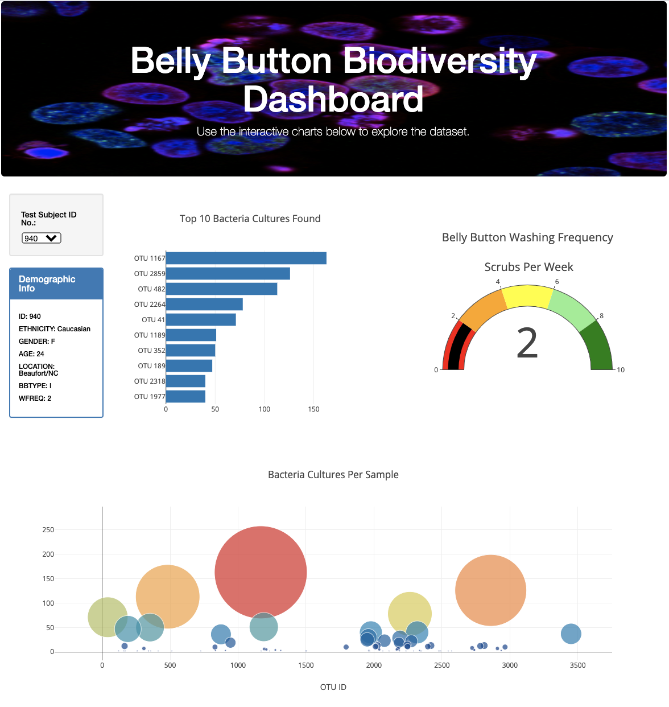

# Plotly-Chart

## Overview of Analysis

The purpose of this project is to disover and document bacteria that can syntehize protein that tastes like beef. The data will specifically test the hypothesis that human belly button bacteria will produce the best results. The analysis will focus on creating a dashboard that visualizes the bacterial data for both research participants and fellow researchers to access.

## Results

The data preparation utilizes Javascript, Plotly, HTML and CSS to analyze and create a dynamic dashboard with a drop down menu. The dashbooard is generated on the <a href="index.html">index HTML webpage file</a>. 

The webpage is created by altering the <a href="Data/samples.json">data</a> to make an <a href="charts.js">application</a>. The webpage also utilizes <a href="static/css/style.css">CSS</a> to make it easy to read and more aesthetic.  

### Overview of Dashboard

**1. Drop Down Menu & Demographic Information**

The drop down menu is used to select the individual's ID and showcase the demographic information of that specific individaul. 

**2. Bar Chart**

The bar chart is used to display the top 10 bacterial species (OTUs) when an individual’s ID is selected from the dropdown menu on the webpage.

**3. Guage**

The guage is used to display the weekly washing frequency's value, and display the value as a measure from 0-10 on the progress bar in the gauge chart when an individual ID is selected from the dropdown menu

**4. Bubble Chart**

The bubble chart is used display the following when an individual’s ID is selected from the dropdown menu webpage:

- The otu_ids as the x-axis values.
- The sample_values as the y-axis values.
- The sample_values as the marker size.
- The otu_ids as the marker colors.
- The otu_labels as the hover-text values.